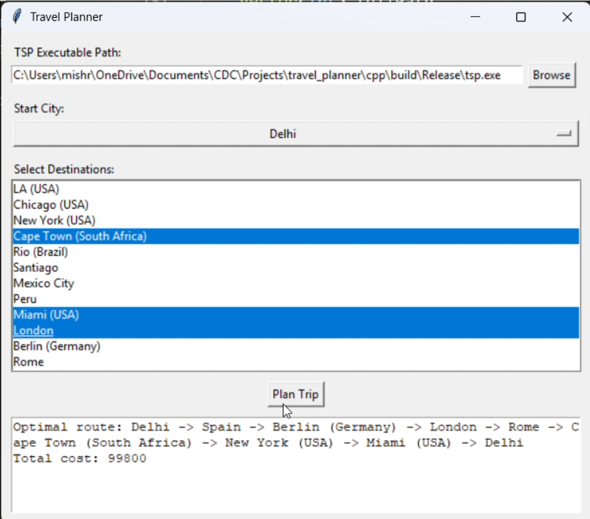

# Travel Planner

A scalable travel planner that computes optimal routes across dozens of cities using advanced graph algorithms and dynamic programming, with an interactive Tkinter-based GUI for easy city selection and result visualization.

**GitHub:** [https://github.com/adarshmishra1310/Travel-Planner](https://github.com/adarshmishra1310/Travel-Planner)

---

## Directory Structure
```
Travel-Planner/
├── README.md                   # README
├── cpp/                        # C++ solver
│ ├── CMakeLists.txt            # CMake build script
│ ├── tsp.cpp                   # Bitmask‑DP + Floyd–Warshall implementation
│ └── build/                    # Out‑of‑source build artifacts
└── gui/                        # Python front‑end
└── gui.py                      # Tkinter interface code
```

## Setup & Build

```bash
# 1. Clone the repository
git clone https://github.com/adarshmishra1310/Travel-Planner.git
cd Travel-Planner

# 2. Build the C++ solver with CMake
mkdir -p cpp/build
cd cpp/build
cmake --build . --config Release
```

## Run
```bash
python gui/gui.py
```

## 📽️ Demo

